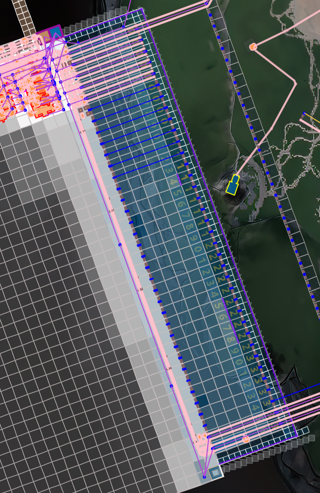
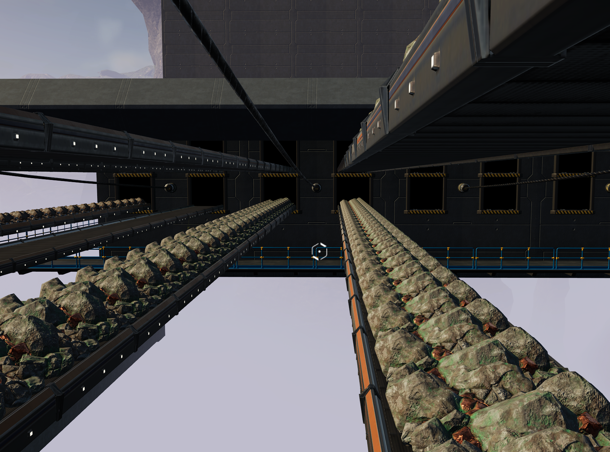
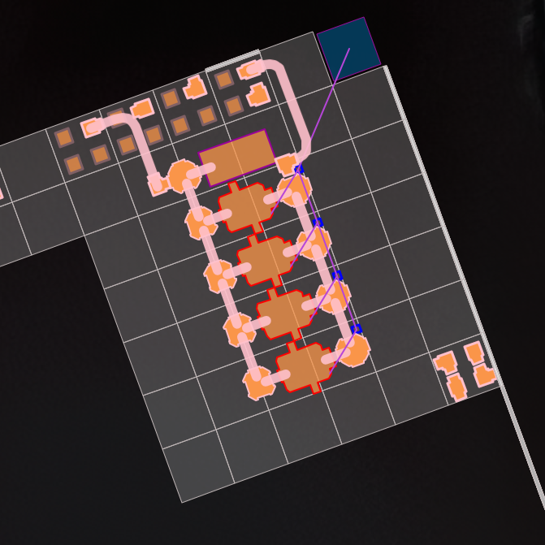
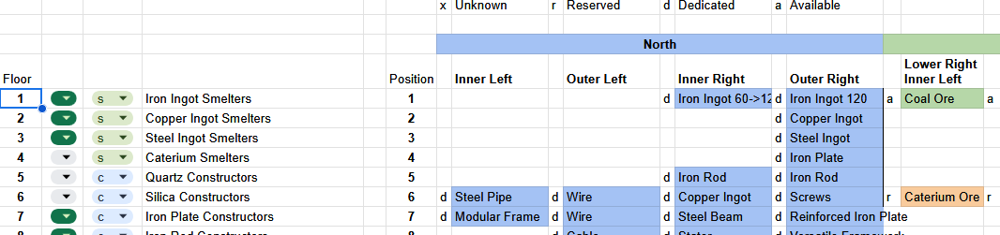

# Satisfactory Megafactory

> [!WARNING]
> The tool is in heavy development and is not ready to be used yet.

This repo contains a tool used to plan the Megafactory.
The goal of this tool is to help prepare designs for Satisfactory using the "Megafactory" approach.
With this, the amount of factory building is kept to the minimum.

Each Megafactory will have a fixed amount of inputs which will be fed ores directly.
Like in this example, the east side of this Megafactory have 36 inputs.

Each input supports up to 4 belts.

> [!NOTE]
> As a pure node with Miner Mk3 and Conveyor Belt Mk6 is able to handle 1200/m items, you should always try to maximize capacity of belts.
> To do that, keep one belt per pure node. Merge two normal nodes into one belt. And merge 4 impure nodes into one belt.

Once connected, these ports are transported on a floor for processing using conveyor lifts.

A floor is then dedicated to the procssing of one recipe.
The floor is composed of several production lines.
These production lines take their input from the conveyor lifts and will output in another conveyor lift.

Here is a simple example of one production line with the following parameters:
* Input item: 120 Iron Ingot/s
* Output item: 80 Iron Plate/s
* Input location: Input North, Position 1, Port Outer Right
* Output location: Input North, Position 4, Port Outer Right

## Why use this design

This approach brings several advantages compared to the more "organic" approch:
* Each floor builds only one item and therefore is easy to find (even more with elevators and floor naming)
* Production lines can scale with time (like from North to South in the previous example) to match Conveyor Belts and Miner upgrades
* As each output is dedicated to only one input, it is easy to find bottlenecks

## Here comes the tool

As every FICSIT pioneers, I started my design with pen and paper.
I quickly completed with Google Sheets in parallel.

Now the sheet is starting to show its limits, and it is time for an absolute overkill solution.
The goal of this tool is improve what was in the sheet (like having belt speeds) but also add functionnality hardly doable before.
Like having a floor plan of each level.
Or having an overall view of all Conveyor Lifts to be able to determine the best to use for a new production line.

### To Do

As stated at the beginning of the document, the tool is not yet ready to be used.
There are still many work remaining to be as useful as the Google Sheet.
The list being:

- [ ] CRUD on floors
- [ ] CRUD on production line
- [x] Allow multiple Megafactory
- [ ] Compute input and output speed per floor
- [ ] Render floor plan with lift usage
